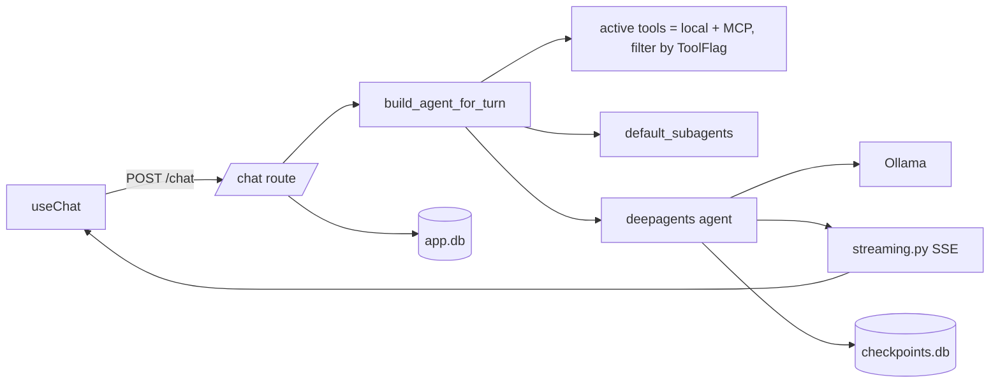
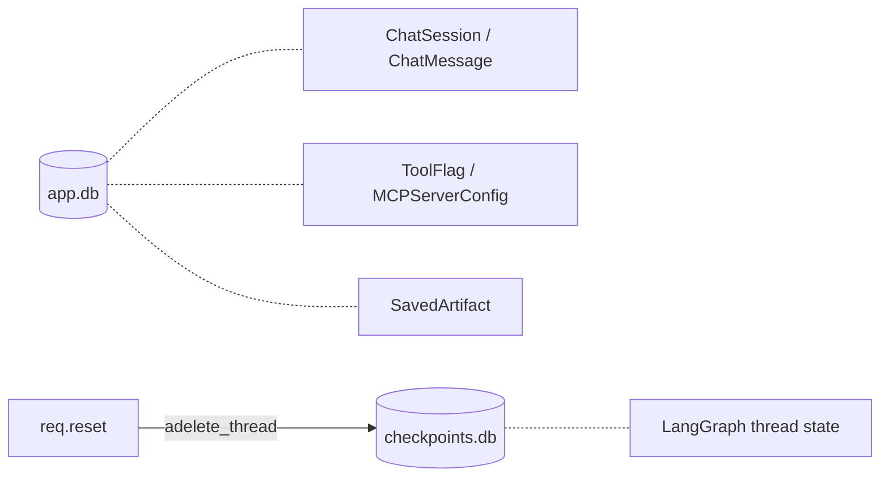

## Where to look

| Module       | Path                                | Owns                                                   |
| ------------ | ----------------------------------- | ------------------------------------------------------ |
| Core         | `backend/app/main.py` + `app.state` | Lifespan, app-scoped singletons.                       |
| Commands     | `backend/app/commands/`             | Slash commands, dispatch.                              |
| Tools        | `backend/app/tools/`                | Auto-discovered LangChain tools.                       |
| MCPs         | `backend/app/mcp_registry.py`       | Hot-reloadable MCP servers.                            |
| Streaming    | `backend/app/streaming.py`          | AI SDK UI parts; subagent nesting.                     |
| Persistence  | `backend/app/db.py`, `models.py`    | `app.db` + LangGraph `checkpoints.db`.                 |
| Frontend     | `frontend/app/`                     | UI, transport, tool render registry.                   |

## Per-turn flow

## Two databases

`app.db` survives resets. `checkpoints.db` is wiped per-thread when
`req.reset == true`.
