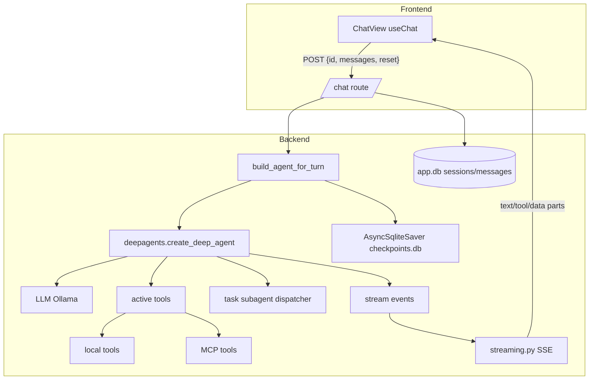
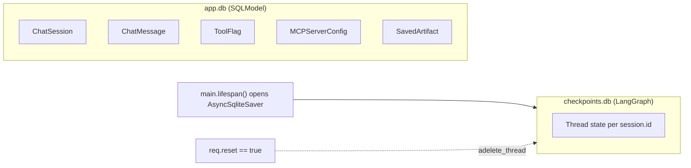

## Repo layout

```
local-code/
├── backend/                       # FastAPI + LangGraph + deepagents
│   └── app/
│       ├── main.py                # lifespan, app.state wiring
│       ├── config.py              # pydantic-settings
│       ├── llm.py                 # Ollama / Gemma client cache
│       ├── streaming.py           # AI SDK 6 UI message stream emitter
│       ├── tool_registry.py       # discovery + flag-filtered active set
│       ├── mcp_registry.py        # hot-reloadable MCP servers
│       ├── skills_registry.py
│       ├── observability.py       # loguru
│       ├── auth.py                # X-User-Email -> User
│       ├── db.py                  # SQLModel async session
│       ├── models.py              # ChatSession, ChatMessage, ...
│       ├── artifact_store.py
│       ├── commands/              # slash command framework
│       ├── graphs/                # main_agent + state
│       ├── integrations/
│       ├── middleware/
│       ├── routes/                # FastAPI routers (one per resource)
│       ├── schemas/               # request/response pydantic models
│       ├── services/
│       ├── tasks/
│       └── tools/                 # auto-discovered LangChain tools
└── frontend/                      # Next.js 16 App Router
    └── app/
        ├── _components/
        │   ├── ChatView.tsx       # useChat + subagent grouping
        │   ├── ChatShell.tsx
        │   └── tools/             # tool render registry
        ├── chat/
        ├── settings/
        ├── tasks/
        └── login/
```

## Module ownership

| Module       | Path                          | What it owns                                                                                  |
| ------------ | ----------------------------- | --------------------------------------------------------------------------------------------- |
| Core         | `backend/app/main.py`, `app.state` | Lifespan, app-scoped singletons (LLM cache, checkpointer, MCP registry, command registry).    |
| Commands     | `backend/app/commands/`       | Slash command discovery + dispatch (`/feedback`, `/remember`, ...).                           |
| Tools        | `backend/app/tools/`          | Auto-discovered `BaseTool` instances, exported at module scope.                               |
| MCPs         | `backend/app/mcp_registry.py` | Connections to MCP servers stored in `app.db`; tools merged into the active set.              |
| Streaming    | `backend/app/streaming.py`    | Translates LangGraph events into AI SDK UI parts; subagent nesting via `parentToolCallId`.    |
| Persistence  | `backend/app/db.py`, `models.py`, `checkpoints.db` | SQLModel + LangGraph checkpointer.                          |
| Frontend     | `frontend/app/`               | UI, transport, tool rendering.                                                                |

## Data flow at a glance



## Two databases, two lifetimes


