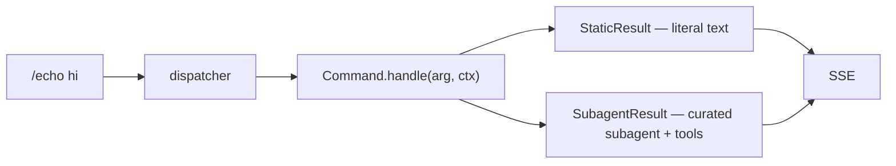

A **command** is anything starting with `/` in chat. Drop a Python file
in `backend/app/commands/`; the registry auto-imports it.

Two result types:

- `StaticResult` — assistant text, streamed verbatim.
- `SubagentResult` — delegate to a subagent with a curated tool list.

`discover_commands()` runs once at lifespan and stores the dict on
`app.state.commands`. Files named `base.py`, `dispatcher.py`,
`registry.py` are skipped.

→ [Add a slash command](/guides/add-a-command/)
