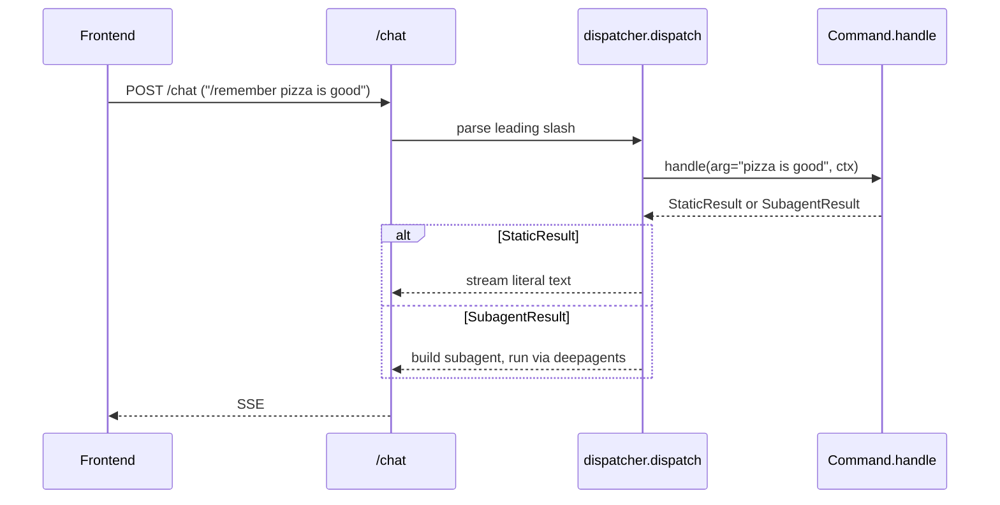

A **command** is anything the user invokes with a leading `/` in chat
(`/feedback`, `/remember`, ...). The framework lives in
`backend/app/commands/`.

## Files

| File             | Role                                                                  |
| ---------------- | --------------------------------------------------------------------- |
| `base.py`        | `Command` protocol, `CommandContext`, `StaticResult`, `SubagentResult`. |
| `registry.py`    | `discover_commands()` — auto-imports modules, finds `Command` objects.  |
| `dispatcher.py`  | Parses `/name args` from a user turn and routes it.                   |
| `feedback.py`, `remember.py`, `stream_static.py` | Built-in commands.       |

## The `Command` protocol

```python
@runtime_checkable
class Command(Protocol):
    name: str
    description: str
    arg_hint: str

    async def handle(self, *, arg: str, ctx: CommandContext) -> CommandResult: ...
```

A command returns one of:

- `StaticResult(text=...)` — a literal assistant message; streamed verbatim.
- `SubagentResult(subagent=..., user_message=..., tool_names=[...])` —
  routes the turn through a subagent with a curated toolset.

## Discovery

```mermaid
flowchart LR
    A[discover_commands] --> B{iter_modules in app.commands}
    B --> C[skip base / dispatcher / registry]
    C --> D[importlib.import_module]
    D --> E[inspect module members]
    E --> F{isinstance Command?}
    F -- yes --> G[register by name]
    F -- no --> H[skip]
    G --> I[returns dict[name, Command]]
```

`discover_commands()` runs once during lifespan and the result lives at
`app.state.commands`. Add a new file in `app/commands/` exporting a module
attribute that satisfies the `Command` protocol — it shows up next
restart.

## Dispatch path



See [Add a slash command](/guides/add-a-command/) for the recipe.
