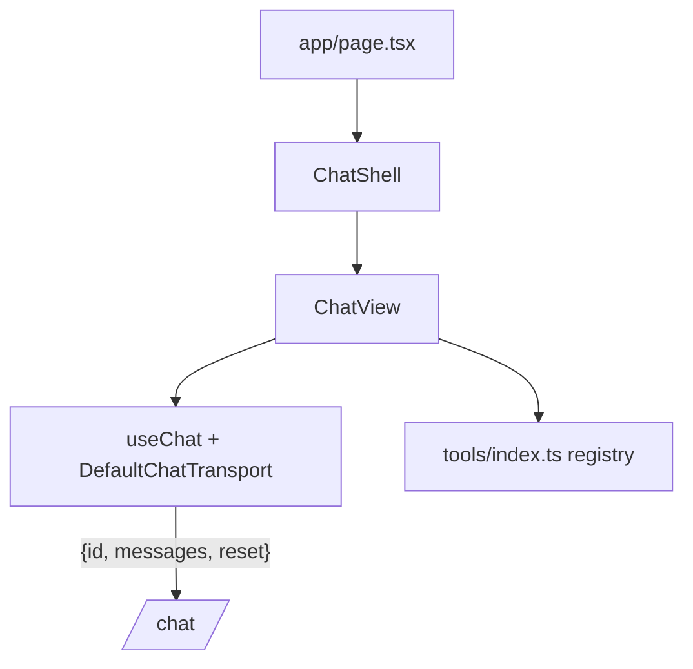

## Transport

`ChatView` constructs `useChat` with `DefaultChatTransport` →
`CHAT_URL`. `prepareSendMessagesRequest` shapes the body to match
`ChatRequest`. Other REST goes through `lib/api.ts`
(`NEXT_PUBLIC_BACKEND_URL_BASE`).

## Tool render registry

```ts
// frontend/app/_components/tools/index.ts
export const toolComponents: Record<string, ComponentType<ToolPartProps>> = {
  sql_query: SqlQueryTool,
  // ...
};
```

Map key = `BaseTool.name`. Missing key → generic JSON renderer.
Subagent grouping (`getParentToolCallId`) is handled higher up — your
component just renders one part.

## Notes

- Path alias `@/*` → `frontend/` root.
- shadcn: `npx shadcn@latest add <name>` from `frontend/`.
- Tailwind v4 — config is CSS-driven via `@theme` in `app/globals.css`.
- Read `frontend/node_modules/next/dist/docs/` before reaching for a
  Next.js API. Training data is older than installed Next 16.

→ [Render a custom tool UI](/guides/render-tool-ui/)
