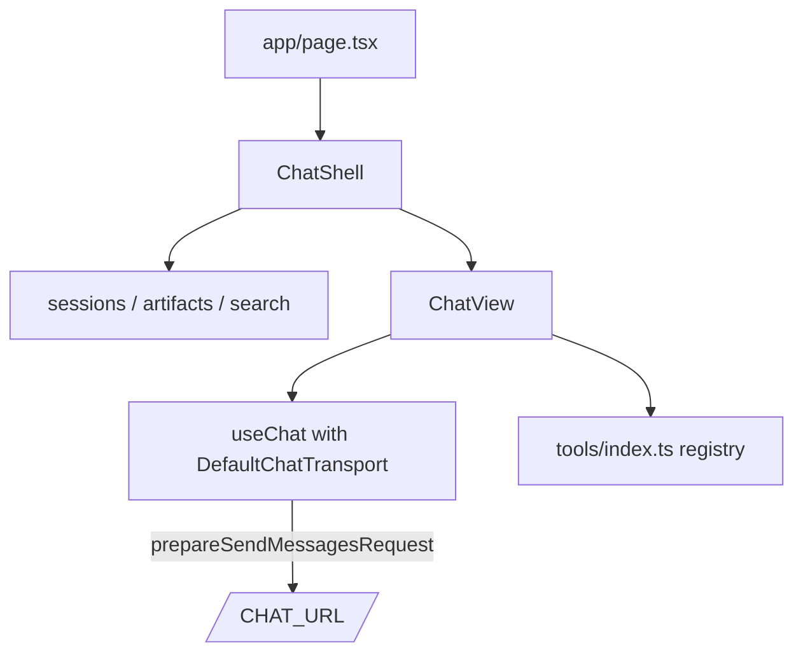
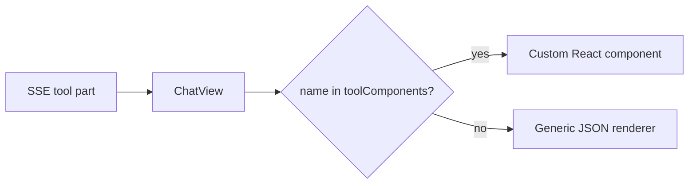

The frontend is a Next.js 16 App Router app under `frontend/`. It uses
`@ai-sdk/react`'s `useChat` to stream from `POST /chat`.

## Top-level layout



## Transport

`ChatView` constructs `useChat` with a `DefaultChatTransport` pointed at
`CHAT_URL`. `prepareSendMessagesRequest` shapes the body to match the
backend's `ChatRequest` schema:

```ts
{ id: sessionId, messages: uiMessages, reset?: boolean }
```

`lib/api.ts` is the REST client for everything else (sessions, MCP CRUD,
tool flags, artifacts, ...). Its base URL comes from
`NEXT_PUBLIC_BACKEND_URL_BASE`.

## Path alias

`@/*` maps to the `frontend/` root. Imports look like
`import x from "@/lib/api"`.

## Tool render registry

`frontend/app/_components/tools/index.ts` exports a map:

```ts
export const toolComponents: Record<string, ComponentType<ToolPartProps>> = {
  sql_query: SqlQueryTool,
  python_exec: PythonExecTool,
  // ...
};
```

When `ChatView` renders a tool part it looks up `toolComponents[name]`
and falls back to a generic JSON-blob renderer if absent.



See [Render a custom tool UI](/guides/render-tool-ui/).

## Subagent grouping

Tool parts whose `providerMetadata.subagent.parentToolCallId` matches an
outer `task` tool call's id are rendered **inside** that outer tool's UI.
`getParentToolCallId` reads the metadata; the rendering tree groups by
parent so subagent activity is visually nested under its dispatcher.

## shadcn / Tailwind

shadcn components live in `frontend/components/ui/`. Add new ones with:

```bash
npx shadcn@latest add <name>      # run from frontend/
```

Tailwind v4 — config is CSS-driven via `@theme` in `app/globals.css`. Don't
add a `tailwind.config.ts`.

## Read the installed Next docs

Training data is older than installed Next 16. Before reaching for a
Next.js API, check `frontend/node_modules/next/dist/docs/`.
