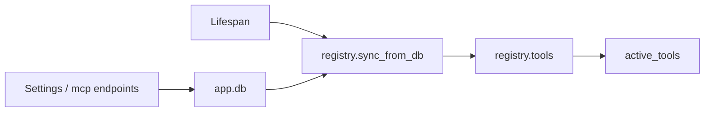

`MCPRegistry` connects to configured MCP servers and exposes their tools
to the agent merge.



## Connection shapes

```jsonc
{ "transport": "streamable_http", "url": "https://docs.langchain.com/mcp" }
{ "transport": "stdio", "command": "uvx", "args": ["some-mcp-package"] }
```

Toggling `enabled` toggles whether that server's tools appear in the
active set. A failed server is logged and skipped — its tools just don't
show up. **Don't add retries or fallbacks** in caller code; surface the
state as-is.

→ [Add an MCP server](/guides/add-an-mcp/)
