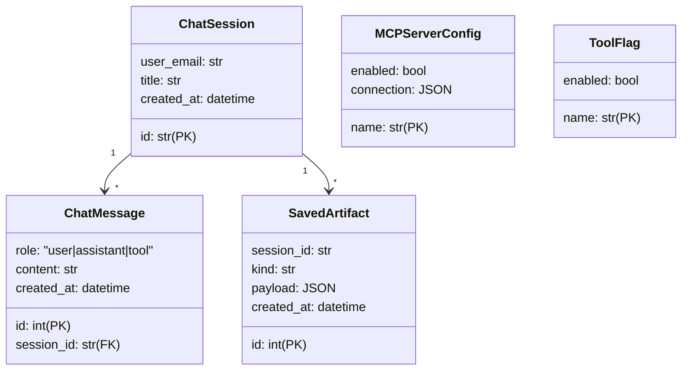
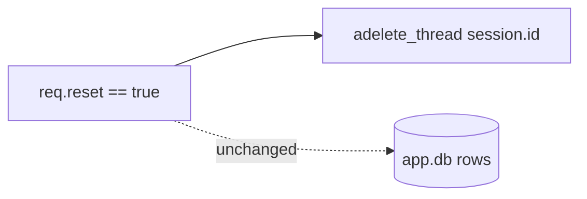

There are **two** SQLite databases. They serve different roles and have
different lifetimes.

## `app.db` — application state

Driver: SQLModel + `aiosqlite`. Sessions come from
`app.db.async_session()`.



## `checkpoints.db` — LangGraph thread state

Driver: `langgraph.checkpoint.sqlite.aio.AsyncSqliteSaver`. Opened **once**
in `lifespan` as a context manager. Closing it tears down the writer.

```python
async with AsyncSqliteSaver.from_conn_string(settings.checkpoint_db_path) as saver:
    app.state.checkpointer = saver
    ...
    yield
```

Important: don't open another saver elsewhere. Anything that needs to
delete a thread should use the saver on `app.state`:

```python
await app.state.checkpointer.adelete_thread(req.id)
```

## Reset semantics



We deliberately **do not** wipe `ChatMessage` history on reset — only the
LangGraph checkpoint. This lets the user start a fresh agent run while
keeping the visible transcript.

## Migrations

There aren't any. SQLModel's `init_db()` runs `metadata.create_all` on
boot. If you change a model's schema in a way that needs migration, do
the migration explicitly.
