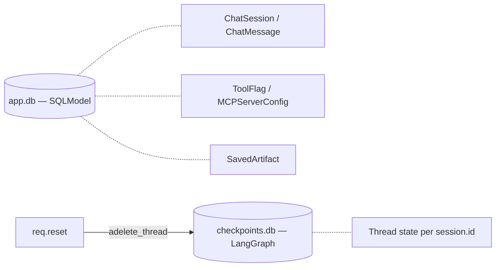

Two SQLite databases, two roles.



## `app.db`

SQLModel + `aiosqlite`. Sessions from `app.db.async_session()`. No
migrations — `init_db()` runs `metadata.create_all` on boot.

## `checkpoints.db`

`AsyncSqliteSaver`, opened **once** in `lifespan` as a context manager.
Don't open another saver elsewhere — use `app.state.checkpointer`.

```python
await app.state.checkpointer.adelete_thread(req.id)
```

`req.reset` deletes only the LangGraph thread; `ChatMessage` history in
`app.db` is left intact so the visible transcript persists.
