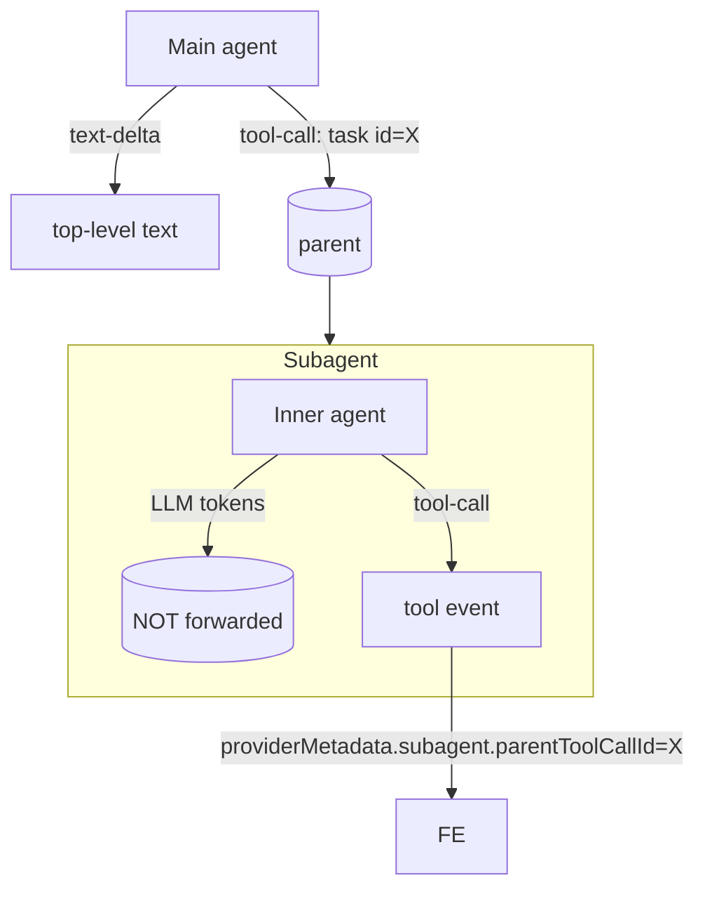

Backend emits the **Vercel AI SDK 6 UI message stream** (SSE,
JSON-per-line). Header: `x-vercel-ai-ui-message-stream: v1`. Frontend
consumes via `@ai-sdk/react` `useChat` natively.

## Subagent nesting

Rules in `streaming.py`:

- Dispatcher tools (currently `{"task"}`) are subagent roots.
- Tool events with non-empty `namespace` get tagged
  `providerMetadata.subagent.parentToolCallId = <root id>`.
- Inner LLM text deltas are **dropped** at the top level — they belong
  inside the parent tool's result.
- Frontend (`getParentToolCallId`) groups by parent.

## Don't

- Don't invent ad-hoc SSE event names — use AI SDK part types.
- Don't forward subagent text deltas at the top level.
- Don't strip the `x-vercel-ai-ui-message-stream: v1` header.
