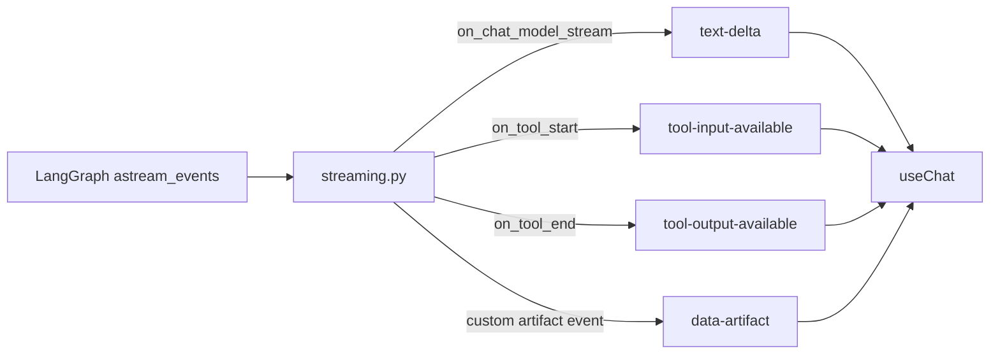
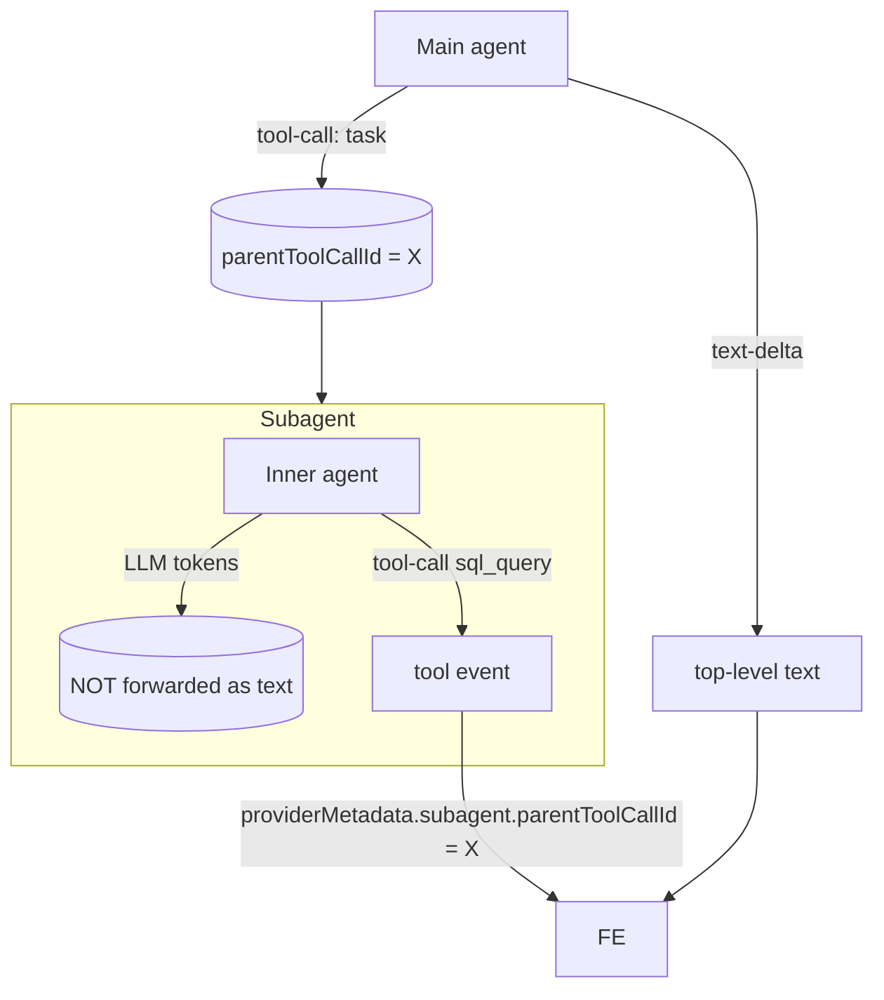

The backend streams responses in the **Vercel AI SDK 6 UI message stream**
format so the frontend's `@ai-sdk/react` `useChat` consumes them
natively.

The contract:

- HTTP response carries header `x-vercel-ai-ui-message-stream: v1`.
- Body is SSE: a sequence of newline-delimited JSON parts (text deltas,
  tool input/output events, data parts).

## Top-level → frontend parts

## Subagent nesting

`deepagents` ships a built-in `task` dispatcher tool. When the main agent
calls `task(...)`, that runs an inner agent with its own LLM tokens and
inner tool calls. We **don't** want those inner LLM tokens to appear as
top-level assistant text — they'd interleave with the outer turn.

Rules implemented in `streaming.py`:

1. The set of dispatcher tool names is currently `{"task"}`. When one
   starts, we record its `tool_call_id` as a "subagent root".
2. Any tool event with a non-empty `namespace` is treated as nested. We
   tag it with `providerMetadata.subagent.parentToolCallId = <root id>`.
3. Inner LLM token streams (text deltas inside a subagent) are **not**
   forwarded as top-level text deltas. They're rendered, if at all,
   inside the dispatcher tool's result.
4. The frontend (`getParentToolCallId` in `ChatView.tsx`) reads
   `providerMetadata.subagent.parentToolCallId` and groups inner events
   under the parent tool call's UI block.

## Reset and cancellation

- `req.reset` deletes the LangGraph thread state (see
  [Persistence](/modules/persistence/)). The frontend uses this for "new
  chat from this session".
- `useChat` aborts the fetch on unmount or stop; the backend handles the
  resulting `CancelledError` cleanly because `astream_events` is
  cancellation-safe.

## What you should *not* do

- Don't invent ad-hoc SSE event names. Use AI SDK part types.
- Don't strip `x-vercel-ai-ui-message-stream: v1`. The frontend won't
  parse the stream.
- Don't forward subagent text deltas at the top level. The UI expects them
  bundled inside the parent tool call's render.
