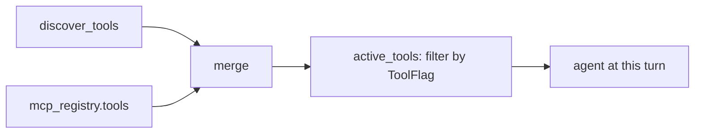
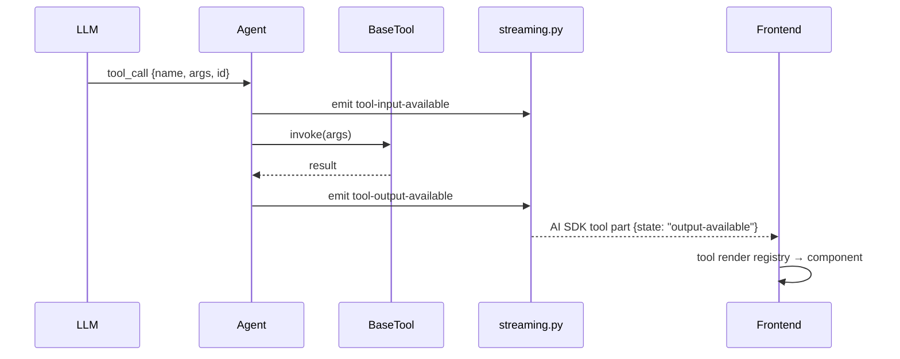

A **tool** is a `langchain_core.tools.BaseTool` instance exported at
module scope from a file in `backend/app/tools/`. They are bound to the
agent on every turn, filtered through `ToolFlag`.

## Discovery

```python
# backend/app/tool_registry.py
def discover_tools() -> list[BaseTool]:
    found: list[BaseTool] = []
    for _, name, _ in pkgutil.iter_modules(tools_pkg.__path__, ...):
        mod = importlib.import_module(name)
        for _, obj in inspect.getmembers(mod):
            if isinstance(obj, BaseTool):
                found.append(obj)
    return found
```

Anything you export as a module attribute that satisfies `isinstance(_,
BaseTool)` is picked up. Decorate with `@tool` from `langchain_core` or
subclass `BaseTool` directly.

## Active set



`active_tools(local, mcp, flags)` keeps tools where `flags.get(t.name,
True)` is true — meaning **unflagged tools default to enabled**. Toggling
in the Settings UI writes a `ToolFlag` row, which is read fresh per turn.

## Files in `app/tools/` today

| Tool module                    | Notes                                              |
| ------------------------------ | -------------------------------------------------- |
| `email_draft.py`               | Drafts an email from structured input.             |
| `gather_feedback_metadata.py`  | Used by `/feedback`.                               |
| `pptx_generator.py`            | Builds a `.pptx` artifact.                         |
| `python_exec.py`               | Sandboxed Python execution.                        |
| `quiz.py`                      | Quiz workflow.                                     |
| `read_table.py`                | Reads tabular data into the chat.                  |
| `sql_query.py`                 | Direct SQL against the embedded Chinook DB.        |
| `sql_subagent_query.py`        | Subagent variant — uses cached `schema_blob()`.    |
| `submit_feedback_issue.py`     | Posts feedback as an issue.                        |
| `web_fetch.py`                 | Fetches and summarizes a URL.                      |

## How a tool call surfaces



The frontend renders tool output via the registry in
`frontend/app/_components/tools/index.ts` (see
[Render a custom tool UI](/guides/render-tool-ui/)).

## Don't bake state into the tool object

Tools are constructed at import time and shared across all turns and
users. Anything user-scoped must come from the tool's input args or a
context object passed in by the agent — not module globals.
