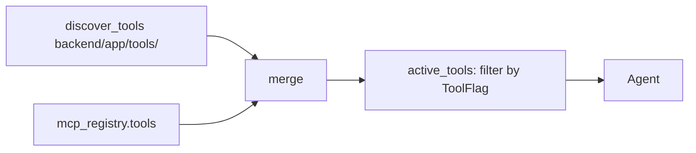

A **tool** is any `BaseTool` instance exported at module scope from a
file in `backend/app/tools/`. They're bound to the agent every turn,
filtered through `ToolFlag`.

Discovery rule: any module attribute satisfying `isinstance(_,
BaseTool)` is registered. `@tool` from `langchain_core` works.

A tool with no `ToolFlag` row defaults to **enabled**. Toggle from the
Settings UI.

## Don't

- **Don't bake state into the tool object.** Tools are shared across
  turns and users; per-call state goes through the args.
- **Don't swallow errors.** Let exceptions bubble — the agent sees them
  as the tool result.

→ [Add a tool](/guides/add-a-tool/) · [Custom tool UI](/guides/render-tool-ui/)
