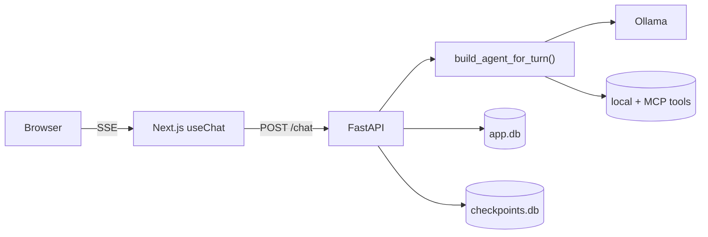

A local agentic chat harness:

- **Backend** — FastAPI + LangGraph + `deepagents` over local Ollama
  (default `gemma4:e4b`). Python 3.14, `uv`.
- **Frontend** — Next.js 16 + React 19 + Tailwind v4 + shadcn/ui. Streams
  via Vercel AI SDK 6.
- **Storage** — `app.db` (SQLModel: sessions, messages, MCP configs, tool
  flags, artifacts) and `checkpoints.db` (LangGraph thread state).

## Three things to remember

1. **Agent is rebuilt every turn.** Tool flags and MCP configs are
   mutable from the UI; we re-read them per request.
2. **Trusted-client deployment.** No per-route auth; `X-User-Email` is
   sufficient identity.
3. **Stream protocol is fixed.** AI SDK 6 UI message stream with header
   `x-vercel-ai-ui-message-stream: v1`.

Start with [Architecture](/architecture/) or jump to a how-to:
[add a tool](/guides/add-a-tool/),
[add a command](/guides/add-a-command/),
[add an MCP](/guides/add-an-mcp/).
