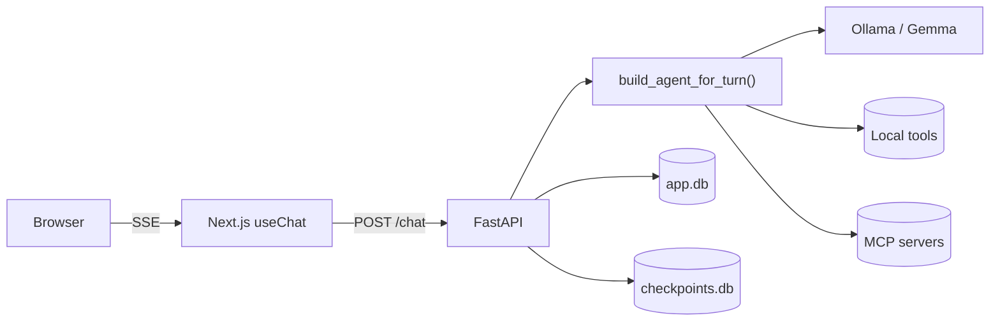

**Local Code** is an agentic chat harness:

- **Backend** — FastAPI + LangGraph + `deepagents` running against a local
  Ollama (default `gemma4:e4b`). Python 3.14, dependencies managed by `uv`.
- **Frontend** — Next.js 16 (App Router, Turbopack) + React 19 + Tailwind v4
  + shadcn/ui. Streams from the backend via Vercel AI SDK 6 (`useChat`).
- **Storage** — two SQLite databases: `app.db` (SQLModel — sessions,
  messages, MCP configs, tool flags, saved artifacts) and `checkpoints.db`
  (LangGraph `AsyncSqliteSaver` for thread state).

## High-level shape

## Key invariants

- **Agent is rebuilt per turn.** `ToolFlag` and `MCPServerConfig` change
  between turns, so `build_agent_for_turn` reads the live registry on every
  `/chat`. Only the LLM cache, checkpointer, MCP registry and command
  registry live on `app.state`.
- **Trusted-client deployment.** No per-route auth/ownership checks in the
  app; `X-User-Email` is sufficient identity. Don't add gating, CSRF, or
  rate limits unless the task says so.
- **Streaming protocol is fixed.** Backend emits the Vercel AI SDK 6 UI
  message stream; the response carries the
  `x-vercel-ai-ui-message-stream: v1` header.

## Where to start

- **Curious how a request flows?** → [How a turn works](/request-lifecycle/)
- **Adding a tool?** → [Add a tool](/guides/add-a-tool/)
- **Adding a slash command?** → [Add a slash command](/guides/add-a-command/)
- **Wiring a new MCP server?** → [Register an MCP server](/guides/add-an-mcp/)
