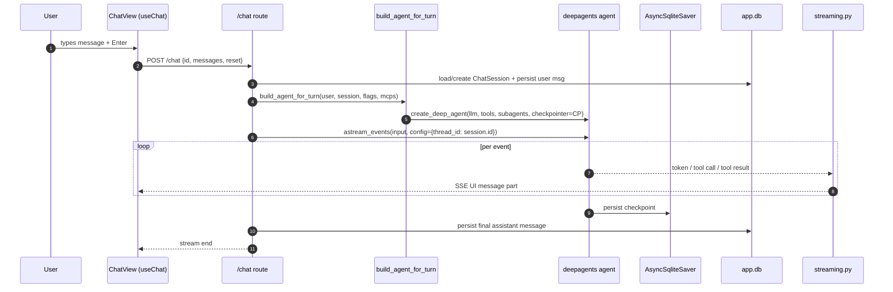
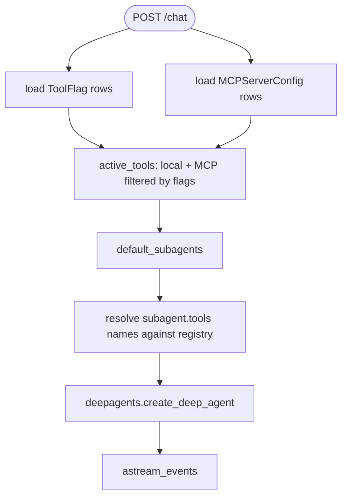
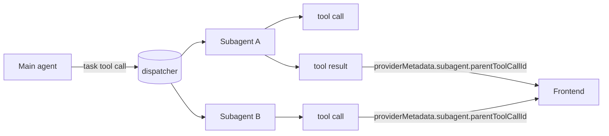

A single turn is the unit of work in this app. Understanding it makes every
other module obvious.

## End-to-end sequence

## What `build_agent_for_turn` actually does

The important consequence: **tools and MCP servers can change between
turns** (toggled in Settings, or hot-reloaded via `/mcp`). The agent picks
up the change without a restart, because we re-read the registries every
turn.

## Reset semantics

`ChatRequest.reset == True` causes the route to call
`state.checkpointer.adelete_thread(req.id)` before streaming. Anything in
`app.db` (the message history) is left alone — only the LangGraph thread
state is wiped.

## Subagent calls inside a turn

The dispatcher tool is `task`. Its inner LLM tokens stay nested inside the
tool result on the frontend; only the **top-level** assistant text deltas
are streamed as plain text parts. See [Streaming](/modules/streaming/) for
the full story.
