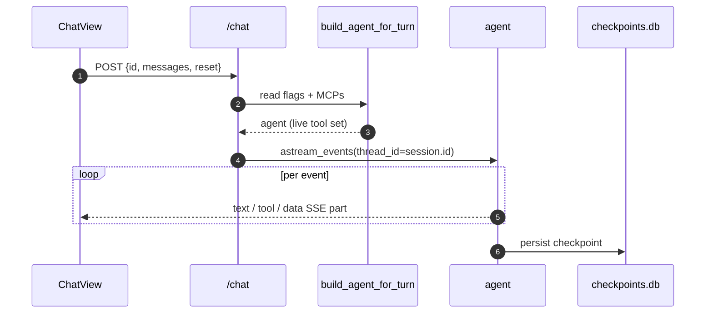

The agent is rebuilt every turn because `ToolFlag` and `MCPServerConfig`
can change between turns (Settings UI, `/mcp` endpoints). We read both
fresh and pass them to `build_agent_for_turn`.

## Reset

`req.reset == true` calls `state.checkpointer.adelete_thread(req.id)`.
LangGraph thread state goes; persisted `ChatMessage` rows in `app.db`
stay.

## Subagents

The dispatcher tool is `task`. When it fires, inner tool events get
`providerMetadata.subagent.parentToolCallId` so the frontend can group
them under their parent. Inner LLM tokens are **not** forwarded as
top-level text — they stay inside the tool result. See
[Streaming](/modules/streaming/).
